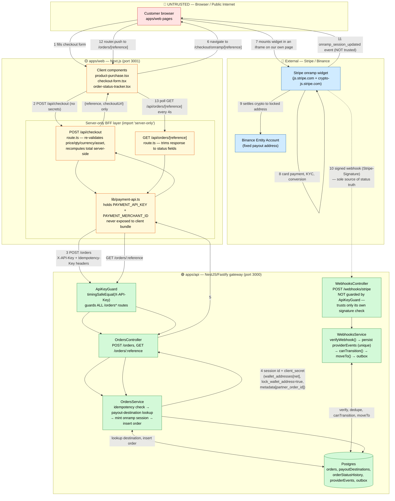
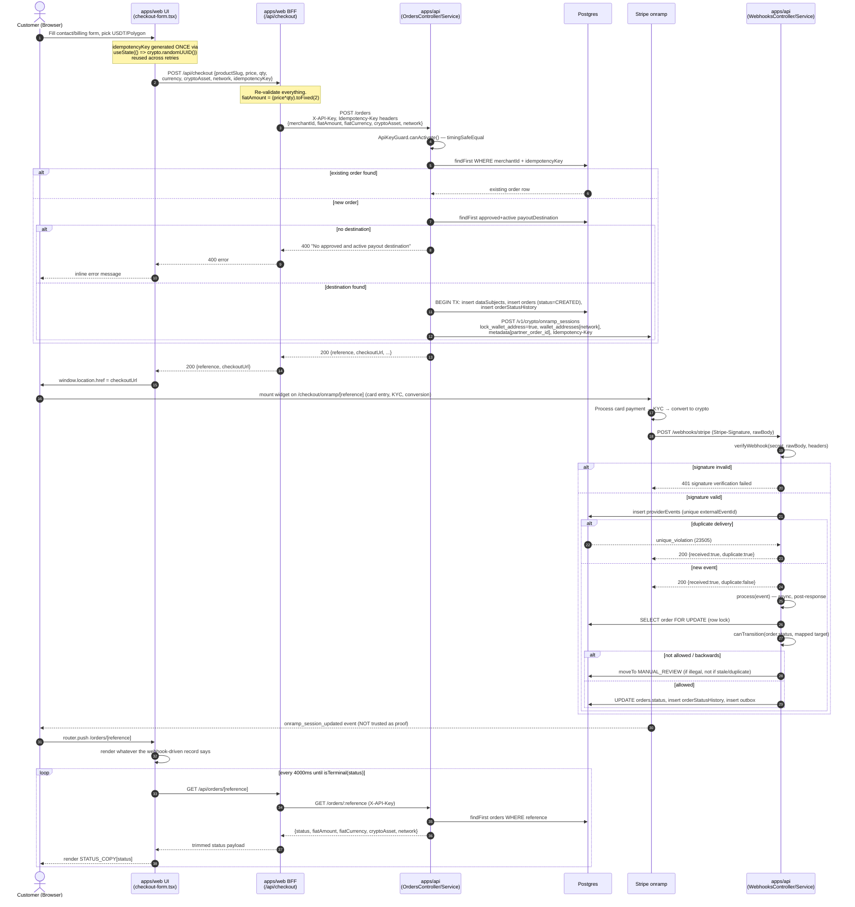
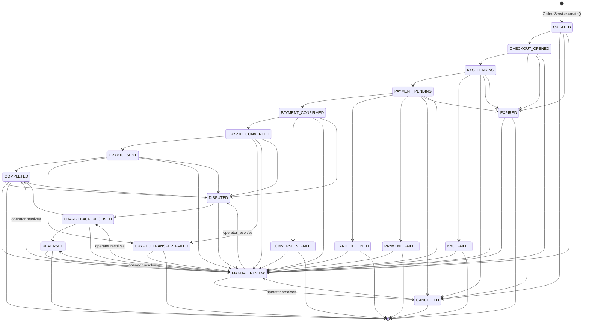

# Payment Platform — Implemented Architecture

This document describes the **as-built** architecture of `payment-platform`, the merged monorepo
that connects the `apps/web` storefront to the `apps/api` crypto payment gateway. It reflects the
actual code in this repository (verified against source, not the original plan) as of this
implementation. See `PAYMENT_INTEGRATION_PLAN.md` for the design rationale and phase history.

---

## 1. Components

| Component | Path | Role |
|---|---|---|
| **Storefront (Next.js)** | `apps/web` | Public-facing catalog/checkout UI. App Router, port `3001`. |
| **Web BFF (Route Handlers)** | `apps/web/src/app/api/**` | Server-only proxy between the browser and the gateway. Holds the shared secret and merchant ID; the browser never sees either. |
| **Payment Gateway API (NestJS)** | `apps/api` | Owns orders, payout destinations, and the Stripe onramp integration. Fastify adapter, port `3000`. |
| **Webhook ingestion** | `apps/api/src/webhooks` | Verifies and records Stripe's signed `crypto.onramp_session.updated` events; the *only* writer of order status. |
| **Provider adapter** | `packages/providers/stripe-onramp` | Mints onramp sessions against `POST /v1/crypto/onramp_sessions`, verifies webhook signatures, maps Stripe's session statuses to internal `OrderStatus`. |
| **Database layer** | `packages/database` | Drizzle ORM + Postgres schema: `orders`, `payoutDestinations`, `orderStatusHistory`, `providerEvents`, `outbox`, `dataSubjects`. Per-order PII encryption (DEK-wrapped). |
| **Shared types** | `packages/shared-types` | Zero-dependency package: `OrderStatus` state machine, `Money` (bigint decimal) helpers, currency/asset decimal tables. Imported by both `apps/api` and `apps/web`. |
| **Stripe onramp (external)** | — | Card → crypto on-ramp. Stripe is the *merchant of record*: it takes the card, runs payer KYC and sanctions screening, converts, and delivers on-chain. Its signed webhook is the only source of payment-status truth. |
| **Binance Entity Account (external)** | — | Fixed settlement destination; the customer never chooses it (`lock_wallet_address=true`), and the webhook handler re-checks the delivered address against the approved one. |

---

## 2. Full architecture — components, data flow, trust boundaries

### Trust boundaries, explicitly

1. **Browser ↔ apps/web (untrusted → app boundary).** Every field in the `POST /api/checkout`
   body is treated as attacker-controlled (`route.ts` comment: *"Every value below is
   attacker-controlled"*). Product existence, price, quantity, currency, and crypto/network
   combination are all re-validated against server-known constraints before anything is
   forwarded. The **total is recomputed** server-side as `price × quantity`, not trusted as a
   pre-formatted string, because this storefront sells custom-quoted goods with no fixed catalog
   price.

2. **apps/web ↔ apps/api (BFF → gateway boundary).** This is the boundary the whole merge was
   built around. `lib/payment-api.ts` is marked `import "server-only"` so bundlers refuse to ship
   it to the client. It is the **only** place `PAYMENT_API_KEY` and `PAYMENT_MERCHANT_ID` exist.
   The gateway enforces this boundary independently with `ApiKeyGuard`, a constant-time
   (`timingSafeEqual`) shared-secret check on `X-API-Key`, applied to the whole `OrdersController`
   (both `POST /orders` and `GET /orders/:reference`). A request with a missing or wrong key never
   reaches `OrdersService`.

3. **apps/api response ↔ apps/web (data-minimization boundary).** The gateway's `OrderResponse`
   is not passed straight through. `/api/checkout` returns only `{ reference, checkoutUrl }`;
   `/api/orders/[reference]` returns only status-relevant fields (reference, status, amount,
   currency, asset, network) — no internal IDs, no PII.

4. **Client event ↔ webhook (the trust model's core boundary).** The widget's
   `onramp_session_updated` event is a **UI signal, not proof of payment** — it is never used to
   advance order status, only to stop making the customer stare at a finished form. Only
   `POST /webhooks/stripe`, verified via `verifyWebhook()` (HMAC-SHA256 over `<t>.<rawBody>`
   against `STRIPE_ONRAMP_WEBHOOK_SECRET`, `v1` scheme only, ±5 minutes), can move an order
   forward. This is enforced at two independent layers: the webhook route rejects unverifiable
   payloads (400), and `OrdersController`'s `GET /orders/:reference` handler comment states
   explicitly it only ever reads a value **only a verified webhook writes**.

5. **Webhook controller is intentionally *not* behind `ApiKeyGuard`.** `WebhooksController` is a
   separate `@Controller('webhooks')`, not decorated with `@UseGuards(ApiKeyGuard)` — Stripe
   cannot present the web BFF's shared secret, so the webhook route authenticates purely via
   signature verification against `rawBody`. Confirmed by reading `app.module.ts`: `ApiKeyGuard`
   is registered as an injectable provider (constructor-injected into `OrdersController`), not as
   an `APP_GUARD`, so it applies only where explicitly attached.

6. **apps/api ↔ Postgres (data boundary).** Customer email is never stored as plaintext — each
   order gets its own `dataSubjects` row with a wrapped DEK; `customerEmailEnc` is
   application-layer encrypted, with a separate `customerEmailIdx` blind index for lookup.

7. **apps/api ↔ Stripe/Binance (settlement boundary).** `buildSessionForm` sets
   `lock_wallet_address=true` and passes a `wallet_addresses[<network>]` sourced only from an **approved,
   unrevoked, active** row in `payoutDestinations` — the payer can never redirect settlement to
   their own address.

---

## 3. Payment sequence flow

Key properties this sequence encodes:
- **Exactly-once order creation** — `(merchantId, idempotencyKey)` is the dedupe key; a client
  retry after a network blip returns the original order rather than creating a duplicate.
- **Webhook processing is decoupled from the HTTP response** — `ingest()` acknowledges the
  provider immediately after persisting the raw event, then processes asynchronously
  (`void this.process(...)`), so a slow DB never causes Stripe to see a timeout and retry a
  webhook already on file.
- **Row-level locking** (`SELECT ... FOR UPDATE`) serializes concurrent webhooks for the same
  order, preventing lost updates when Stripe delivers out-of-order or overlapping events —
  which Stripe explicitly does not guarantee against.
- **The browser redirect and the status page are read-only observers** — nothing the browser does
  after leaving `apps/web` can change an order's status; only the webhook path writes it.

---

## 4. Order status state machine

Source of truth: `packages/shared-types/src/order-status.ts`, shared unmodified by both
`apps/api` (writes it) and `apps/web` (reads it, via `isTerminal()` in `order-status-tracker.tsx`).

### Rules enforced by `canTransition()`

1. **`RANK` is monotonic and checked first.** `RANK[to] < RANK[from]` is always rejected
   (`reason: 'backwards'`) regardless of whether the edge would otherwise be legal — a late,
   out-of-order `PAYMENT_PENDING` webhook arriving after `COMPLETED` is dropped, not applied.
2. **Forward movement along the main sequence is legal, including skips.** Providers don't
   reliably report every intermediate state (a fast card auth can jump straight to
   `PAYMENT_CONFIRMED` with no observed `CHECKOUT_OPENED`/`PAYMENT_PENDING`); requiring strict
   step-by-step progression would misclassify normal orders as integrity failures.
3. **Every off-sequence edge is explicitly enumerated** in `ALLOWED`. Anything not listed —
   same-state, backwards, or simply undeclared — is rejected. `WebhooksService.process()` routes
   a `not-allowed` rejection to `MANUAL_REVIEW` (an integrity problem, escalated to a human);
   `backwards`/`same-state` rejections are silently dropped (expected under retries/out-of-order
   delivery) and the event is still marked processed.
4. **`TERMINAL` is scoped to the payment flow, not the order's whole life.** `COMPLETED`,
   `KYC_FAILED`, `CARD_DECLINED`, `PAYMENT_FAILED`, `CONVERSION_FAILED`,
   `CRYPTO_TRANSFER_FAILED`, `CANCELLED`, `EXPIRED`, `REVERSED` all stop the frontend's polling
   loop (`isTerminal()` in `order-status-tracker.tsx`) — but `COMPLETED` can still transition to
   `DISPUTED`/`MANUAL_REVIEW` later (e.g., a chargeback 120 days out), which is why those two are
   ranked *above* `COMPLETED` rather than being unreachable from it.
5. **Unrecognized provider statuses never guess.** If `mapOnrampStatus()` returns `null` for an
   unmapped value, the order goes straight to `MANUAL_REVIEW` rather than being silently ignored
   or misapplied.

---

## 5. Summary of enforced invariants

| Invariant | Where enforced |
|---|---|
| Browser never sees `PAYMENT_API_KEY` / `PAYMENT_MERCHANT_ID` | `server-only` import in `lib/payment-api.ts`; both env vars read only inside Route Handlers |
| Gateway only accepts requests from the trusted BFF | `ApiKeyGuard` (`timingSafeEqual`) on `OrdersController` |
| No duplicate orders from client retries | `(merchantId, idempotencyKey)` uniqueness check in `OrdersService.create()` |
| No duplicate webhook processing | Unique `externalEventId` constraint on `providerEvents`, caught via Postgres `23505` |
| Settlement address cannot be redirected by the payer | `lock_wallet_address=true` + a `wallet_addresses[<network>]` sourced only from an approved `payoutDestinations` row, **and** a post-hoc check of the delivered `transaction_details.wallet_address` against that row |
| Order status can only move forward, or along an explicit exception edge | `RANK` check + `ALLOWED` table in `canTransition()` |
| Browser navigation is never treated as payment proof | `/checkout/return` only redirects to the status page; status itself is written only by `WebhooksService` |
| Concurrent webhooks for one order can't race | `SELECT ... FOR UPDATE` row lock in `WebhooksService.process()` |
| Currency/asset choices on the storefront can never exceed what the gateway can actually settle | `SUPPORTED_FIAT_CURRENCIES` / `SUPPORTED_CRYPTO_OPTIONS` in `apps/web/src/lib/payment-config.ts`, kept in sync with seeded `payoutDestinations` |
